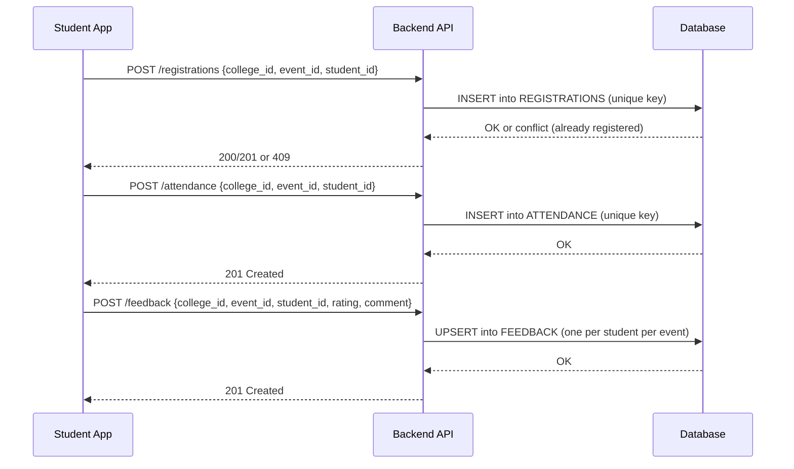

# Campus Event Reporting System — Design Document

> Assignment: Webknot Technologies • Campus Drive  
> Author: (Your Name) • Date: (Edit)  
> Scope: Minimal yet complete reporting backbone for Admin (web) and Student (mobile).

## 1. Objectives
- Enable staff to create events and track **registrations, attendance, and feedback**.
- Produce **Event Popularity**, **Student Participation**, **Top Active Students**, and **type-filtered** reports.
- Keep it simple and production-realistic for ~50 colleges × ~500 students × ~20 events/semester.

## 2. Key Assumptions & Decisions
- **Multi-tenant:** One shared database with **college_id** scoping on every entity. (Simpler ops; easier cross-college analytics.)
- **IDs:**
  - `college_id` unique per college (surrogate key).
  - `event_id` unique **within a college**; global uniqueness is `college_id + event_id`.
  - `student_id` unique **within a college**.
- **Registration constraints:** A student can register **once per event**.
- **Attendance:** Marked on event day via QR or admin console; one row per student per event.
- **Feedback:** Optional; **one feedback per student per event** (1–5 rating, optional comment).
- **Cancellations:** `events.status` can be `SCHEDULED|CANCELLED|COMPLETED`. Cancelled events are excluded from attendance KPI; registrations remain for audit.
- **Soft deletes:** Omitted for simplicity.
- **Time zones:** All timestamps stored as UTC, app displays local.
- **Scaling:** SQLite for prototype; can lift-and-shift to Postgres/MySQL with minimal changes (DDL compatible).

## 3. Data to Track
- **Event lifecycle:** creation, status updates.
- **Student lifecycle:** creation, registration to events, attendance, feedback.
- **Derived metrics:** registration counts, attendance %, average rating.

## 4. ER Diagram (Mermaid)
```mermaid
erDiagram
    COLLEGES ||--o{ STUDENTS : has
    COLLEGES ||--o{ EVENTS : hosts
    STUDENTS ||--o{ REGISTRATIONS : registers
    STUDENTS ||--o{ ATTENDANCE : checks_in
    STUDENTS ||--o{ FEEDBACK : rates
    EVENTS ||--o{ REGISTRATIONS : has
    EVENTS ||--o{ ATTENDANCE : has
    EVENTS ||--o{ FEEDBACK : has

    COLLEGES {
      integer college_id PK
      string  name
      string  code
      datetime created_at
    }

    STUDENTS {
      integer student_id
      integer college_id FK
      string  name
      string  email
      string  roll_no
      datetime created_at
      PK "college_id, student_id"
      UQ "college_id, email"
      UQ "college_id, roll_no"
    }

    EVENTS {
      integer event_id
      integer college_id FK
      string  title
      string  type  "Workshop|Seminar|Hackathon|Fest|Talk"
      string  status "SCHEDULED|CANCELLED|COMPLETED"
      datetime start_time
      datetime end_time
      string  venue
      datetime created_at
      PK "college_id, event_id"
    }

    REGISTRATIONS {
      integer college_id FK
      integer event_id FK
      integer student_id FK
      datetime registered_at
      PK "college_id, event_id, student_id"
    }

    ATTENDANCE {
      integer college_id FK
      integer event_id FK
      integer student_id FK
      datetime checkin_at
      PK "college_id, event_id, student_id"
    }

    FEEDBACK {
      integer college_id FK
      integer event_id FK
      integer student_id FK
      integer rating "1..5"
      string  comment
      datetime submitted_at
      PK "college_id, event_id, student_id"
    }
```

## 5. API Design (REST)
Base URL: `/api/v1`

### Core
- `POST /colleges` — create college.
- `POST /students` — create student (requires `college_id`).
- `POST /events` — create event.
- `PATCH /events/{college_id}/{event_id}` — update status/venue/time.

### Flows
- `POST /registrations` — register a student to an event.
- `POST /attendance` — mark attendance.
- `POST /feedback` — submit feedback (1–5, optional comment).

### Reports
- `GET /reports/event-popularity?college_id=&type=` → list events sorted by registrations (optionally filter by type).
- `GET /reports/attendance-summary/{college_id}/{event_id}` → total registrations, attended, %.
- `GET /reports/avg-feedback/{college_id}/{event_id}` → average rating.
- `GET /reports/student-participation?college_id=&student_id=` → events attended by student.
- `GET /reports/top-active-students?college_id=&limit=3` → by attendance count.

All write endpoints are **idempotent** on natural keys (conflict → 409).

## 6. Workflows (Sequence)

### A) Registration → Attendance → Feedback


## 7. Edge Cases
- Duplicate registration/attendance/feedback → handled by **unique composite PKs**.
- Event cancelled → reject new registrations and attendance (HTTP 422).
- Missing feedback → reports must not fail; treat as `NULL` and ignore in averages.
- Invalid rating → 400.
- Cross-college contamination → prevented by mandatory `college_id` filters on every query.

## 8. Reporting Queries (See `reports/queries.sql`)
- Popularity (registrations per event; optional type filter).
- Attendance % per event.
- Average feedback per event.
- Student participation.
- Top N active students.

## 9. Migration/Scale Notes
- Switch SQLite → Postgres: replace `AUTOINCREMENT` with `GENERATED BY DEFAULT AS IDENTITY`; `UPSERT` becomes `ON CONFLICT`—already compatible.
- Sharding option (future): per-college schema or DB if compliance requires data isolation.

## 10. Security & Validation (Prototype)
- Basic validation on payloads.
- No auth in prototype; in prod use OAuth/JWT (omitted here).

## 11. Test Data
- See `db/seed.sql` to load a tiny dataset for quick report demos.
